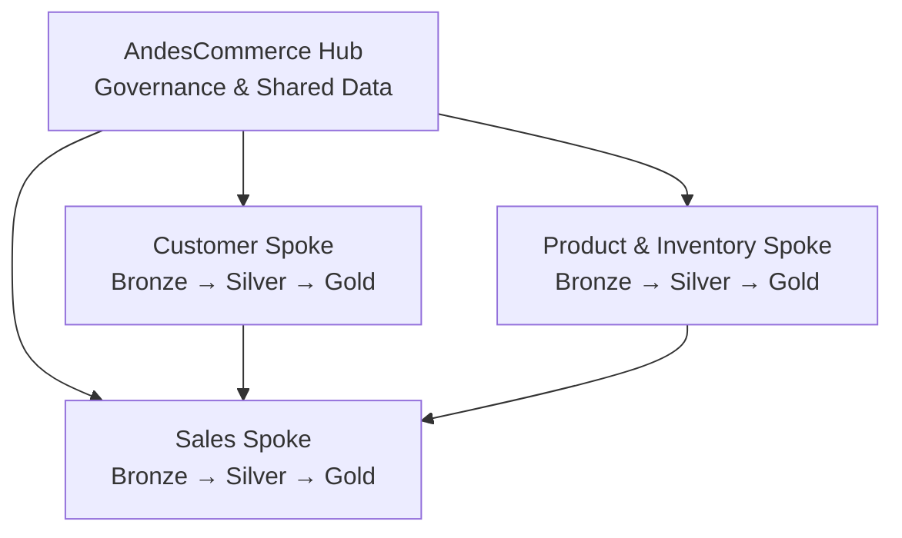

# AndesCommerce - Hub-Spoke and Medallion Architecture

## 1. Objective

AndesCommerce requires a data platform that can grow across multiple business domains while maintaining clear data ownership, governance, security, and analytical capabilities.

The platform combines a Hub-Spoke architecture with the Medallion Architecture.

## 2. Architecture Principles

The architecture separates two concerns:

- **Hub-Spoke** defines data ownership, governance, shared data, and domain boundaries.
- **Medallion Architecture** defines how domain data evolves through Bronze, Silver, and Gold layers.

These architectures are complementary.

## 3. Hub

The Hub provides centralized capabilities and governed corporate data that can be shared across domains.

Development catalog:

`hub_dev`

Schemas:

- `reference`: corporate reference data such as countries, currencies, and sales channels.
- `master`: corporate master data when centralized master-data management is justified.
- `shared`: governed datasets intended for cross-domain consumption.

Not every dataset used by multiple domains must be moved to the Hub.

## 4. Spokes

AndesCommerce initially contains three data domains.

### Sales

Catalog:

`sales_dev`

Responsible for orders, order items, payments, and sales analytical products.

### Customer

Catalog:

`customer_dev`

Responsible for customer data and customer analytical products.

### Product and Inventory

Catalog:

`product_dev`

Responsible for products, inventory, and related analytical products.

## 5. Medallion Architecture

Each operational domain implements:

`Bronze → Silver → Gold`

### Bronze

Stores raw or minimally transformed source data.

### Silver

Contains cleaned, validated, deduplicated, and conformed data.

### Gold

Contains business-ready analytical data products and dimensional models.

## 6. Environment Strategy

The catalog naming convention combines domain and environment:

`<domain>_<environment>`

Examples:

- `sales_dev`
- `customer_dev`
- `product_dev`
- `hub_dev`

The target enterprise architecture can later extend the same principle to QA and Production environments.

## 7. Key Architectural Decision

Centralized governance does not require centralized physical ownership of all data.

A domain can own and publish a governed data product that other domains consume through controlled 

## 8. Logical Architecture

The Hub provides centralized governance and shared corporate data, while each Spoke remains responsible for its own data products.

Cross-domain access is governed rather than requiring all domain data to be physically centralized in the Hub.access.

For example, the Customer domain can remain the owner of customer data while the Sales domain consumes authorized customer information to build sales analytical products.